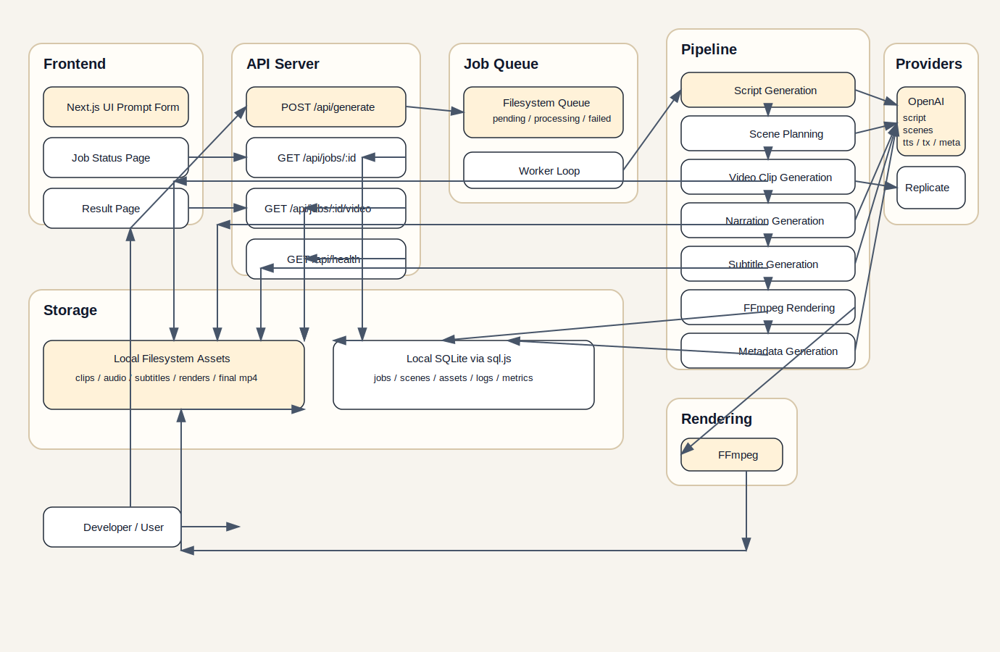

# Architecture Overview

Diagram source: `docs/architecture-diagram.mmd`

## Goals

The current architecture is intentionally small and local-first:

- one Next.js app
- one local worker process
- local filesystem persistence
- no Redis
- no external queue
- one filesystem-backed background queue
- one sequential MVP pipeline executed by the worker

## Project Structure

- `app/`
  Next.js routes, pages, and API handlers.
- `components/`
  Client UI such as the prompt form and live job status panel.
- `lib/config/`
  Environment loading and validation.
- `lib/providers/`
  External service integrations:
  OpenAI script planning, OpenAI TTS, OpenAI transcription, Replicate clip generation.
- `lib/server/`
  Local job store, pipeline orchestration, FFmpeg rendering, filesystem helpers, subtitle utilities.
- `assets/`
  Runtime output for job artifacts such as clips, narration, subtitles, intermediate renders, and final MP4s.

## Request Flow

1. User submits a prompt from the homepage.
2. `POST /api/generate` starts the pipeline.
3. The API route creates a local job record and adds a queue item.
4. The worker claims the next queued job and runs the pipeline asynchronously.
5. Each pipeline stage updates persisted job state, logs, and metrics in the local database.
6. The status page polls `GET /api/jobs/[jobId]`.
7. The result page loads the completed job and embeds the final video from `GET /api/jobs/[jobId]/video`.

## Pipeline Responsibilities

- `lib/providers/openai.ts`
  Generates the script and structured scene plan.
- `lib/providers/replicate.ts`
  Generates and downloads scene clips with retry support.
- `lib/providers/openai-tts.ts`
  Generates one narration audio file with a consistent voice.
- `lib/providers/openai-transcription.ts`
  Transcribes narration audio into timestamped subtitle segments.
- `lib/server/subtitles.ts`
  Converts subtitle segments into SRT.
- `lib/server/ffmpeg.ts`
  Normalizes clips, concatenates them, adds narration, and burns subtitles.
- `lib/server/jobs.ts`
  Reads and writes local job state.
- `lib/server/queue.ts`
  Stores and claims queued background jobs using local JSON files.
- `lib/server/worker.ts`
  Runs the queue loop and retries failed jobs when appropriate.
- `lib/server/pipeline.ts`
  Orchestrates the full prompt-to-video flow for a claimed job.

## Persistence Model

The MVP uses two local persistence layers:

- A local SQLite database under `assets/.data/video-generator.sqlite`
- Per-job filesystem asset directories under `assets/<job-id>/`

Each job gets its own asset directory:

- `assets/<job-id>/clips/`
- `assets/<job-id>/audio/`
- `assets/<job-id>/subtitles/`
- `assets/<job-id>/render/`
- `assets/<job-id>/final-video.mp4`

Structured job state, scenes, generated asset records, step logs, and performance metrics live in the database.
Binary and media artifacts stay on the local filesystem.

Queue files live under:

- `assets/.queue/pending/`
- `assets/.queue/processing/`
- `assets/.queue/failed/`

## Current Constraints

- The pipeline runs sequentially inside the worker process.
- The worker is local-first and intended for development or small MVP usage.
- Final video serving is simple and does not yet support advanced streaming behavior.
